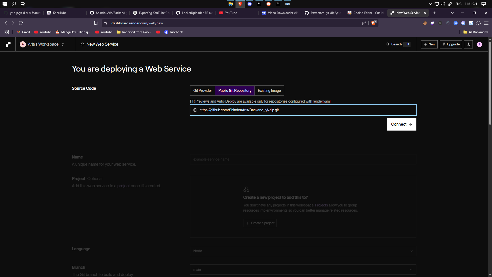
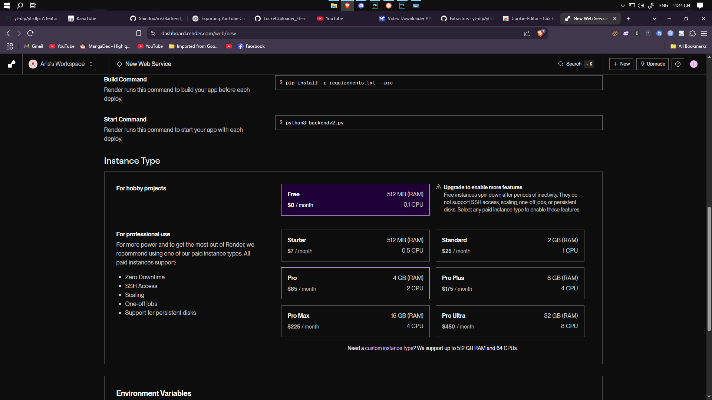
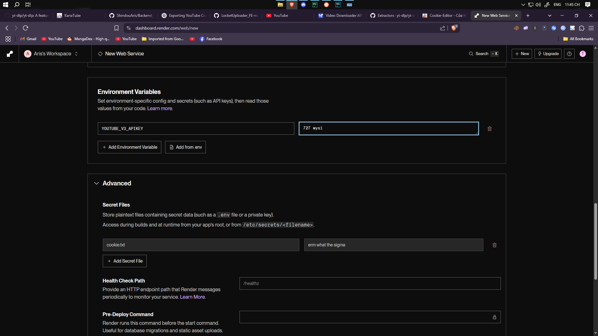

# Video Downloader API

This project provides a FastAPI-based API for downloading videos using `yt-dlp`. It features Bearer token authentication for key endpoints, rate limiting, session management for downloads, automatic file cleanup, and can utilize cookies for downloading videos from platforms requiring login.

---

### 📚 Navigation

* [🚀 Features](#features)
* [📂 Project Structure](#project-structure)
* [🔧 Prerequisites](#prerequisites)
* [🛠️ Local Setup](#local-setup)
    * [Create `.env` file](#3-create-env-file)
    * [Get `cookies.txt`](#4-optional-get-cookiestxt-for-authenticated--pass-robot-check-youtube-downloads)
* [📡 API Endpoints](#api-endpoints)
    * [`/`](#1-get--head-)
    * [`/fetch_data`](#2-post-fetch_data-protected)
    * [`/download`](#3-post-download-protected)
    * [`/files/<session_id>`](#4-get-filessession_id)
    * [`/geo_check`](#5-post-geo_check-protected)
    * [`/server_config`](#6-get-server_config)
* [☁️ Storage Configuration](#storage-configuration)
    * [R2 Storage](#r2-storage)
    * [URL Caching](#url-caching)
* [☁️ Hosting on Render](#hosting-on-render)
* [📝 Notes](#notes)
* [🔐 Security Notes](#security-notes)
* [🧹 Troubleshooting](#troubleshooting)
* [❓ FAQ](#faq)
* [📄 License](#license)
---

## Features

- **Fetch Video Formats**: Get a list of available video and audio formats for a given URL.
- **Download Videos**: Download videos using `yt-dlp` with user-selected formats (protected by Bearer token).
- **Subtitle Support**: 
  - Fetch available subtitle tracks in multiple languages
  - Embed subtitles directly into video files
  - Support for both manual and auto-generated captions
- **Geo-restriction Check**: Check if a YouTube video is geo-restricted (protected by Bearer token, requires Google API Key).
- **Session Management**: Each download is associated with a unique session ID.
- **Automatic File Cleanup**: Downloaded files are automatically deleted after a configurable timeout (default: 30 minutes).
- **Cookie Support**: Uses `cookies.txt` for authenticated downloads and to help bypass robot checks.
- **Rate Limiting**: IP-based rate limiting to prevent abuse.
- **Bearer Token Authentication**: Secures download and geo-check endpoints.
- **Development/Production Modes**:
    - API docs (`/docs`, `/redoc`, `/openapi.json`) are enabled only in development mode.
    - Configurable secret key, rate limits, and rate window via environment variables.
- **Secure File Serving**: Validates session IDs (UUID4) and protects against path traversal.
- **CORS Enabled**: Allows requests from specified origins.
- **R2 Storage Integration**: Optional Cloudflare R2 storage for efficient file handling.
- **URL Caching**: Redis or in-memory caching for faster repeat downloads.

---

# Project structure
```
Backend_yt-dlp/
├── assets/
│   ├── render_deploy_clone_repo.png
│   ├── render_deploy_config.png
│   └── render_deploy_env_sec_config.png
├── downloads/
├── manager/
│   ├── LRU_cache/
│   │   ├── LRU_NODE.py
│   │   └── format_cache.py
│   ├── database_utils/
│   │   ├── r2_storage.py
│   │   └── url_cache.py
│   ├── ffmpeg/
│   │   └── ffmpeg_tools.py
│   ├── geo_utils/
│   │   └── geoblock_checker.py
│   ├── logging/
│   │   └── logging_utils.py
│   ├── models/
│   │   └── subtitle_model.py
│   ├── regex_manager/
│   │   └── regex_manager.py
│   └── ytdlp_tool/
│       └── ytdl_tools.py
├── payloads/
│   ├── facebook_get_format_payload.json
│   ├── instagram_get_format_payload.json
│   ├── tiktok_get_format_payload.json
│   └── youtube_get_data_payload.jsonc
├── template/
│   └── gomen.html
├── .gitignore
├── LICENSE
├── Readme.md
├── backendv2.py
├── cookie.example.txt
├── example.env
├── request_class.py
└── requirements.txt
```

---

## Prerequisites

1.  **Python**: Python 3.8+ installed.
2.  **pip**: Python package manager (usually comes with Python).
3.  **Environment Variables**: Certain features and security settings are configured via environment variables (see `.env` file setup).
4.  **REQUIRED** FFMPEG: for merge audio file with video file. Must be installed and available in your system's PATH. See [Install FFmpeg](#5-install-ffmpeg-required) for instructions.
5.  **(Optional) Google API Key**: For using the `/geo_check` endpoint. Must be set as `YOUTUBE_V3_APIKEY` environment variable.
6.  **(Optional) Render Account**: If you plan to host the application on Render.

---

## Local Setup

### 1. Clone the Repository

```bash
git clone https://github.com/ShindouAris/Backend_yt-dlp.git
cd Backend_yt-dlp
```

### 2. Install Dependencies

It's recommended to use a virtual environment:

```bash
python -m venv venv
# On macOS/Linux:
source venv/bin/activate
# On Windows:
# venv\Scripts\activate
```

Install the required packages:

```bash
pip install -r requirements.txt
```

### 3. Create `.env` file

Create a `.env` file in the project root to configure the application. This is crucial for setting secrets, rate limits, and development behavior.

```dotenv
# Set to "true" for development mode (enables API docs, uses dev secret key, higher rate limits)
# Set to "false" or omit for production mode (disables API docs, uses production secret key/defaults)
DEVELOPMENT=true

# Secret key for Bearer token authentication.
# In production (DEVELOPMENT=false), if not set, it defaults to "youshallnotpassanysecretkey".
# In development (DEVELOPMENT=true), it defaults to "when_the_pig_fly".
# IMPORTANT: For production, set this to a strong, unique secret.
SECRET_PRODUCTION_KEY=your_strong_secret_key_here

# (Optional) Google API Key for /geo_check endpoint
YOUTUBE_V3_APIKEY=your_google_api_v3_key_here

# Rate Limiting Configuration
# Max requests allowed per IP within the RATE_WINDOW.
# Default: 150 (production), 1000 (development)
RATE_LIMIT=150
# Time window in seconds for rate limiting.
# Default: 60 (production), 0 (development, effectively disabling active rate limiting by window)
RATE_WINDOW=60

# Time in seconds before downloaded files are automatically deleted
FILE_EXPIRE_TIME=300

# DISABLE AUTOMATIC FILE DELETION
KEEP_LOCAL_FILES=false

# CORS Configuration
# Multiple origins can be specified using || as separator (e.g., "http://localhost:3000||https://example.com")
# Use "*" to allow all origins (not recommended for production)
ALLOWED_ORIGINS=*

# Forwarded Origins Configuration for Uvicorn
# Multiple origins can be specified using || as separator
# Use "*" to allow all origins (not recommended for production)
FORWARDED_ORIGINS=*
```
- The application loads these variables using `python-dotenv`.
- If `DEVELOPMENT` is `true`, API documentation (Swagger UI at `/docs`, ReDoc at `/redoc`) will be available. These are disabled in production mode.
- `ALLOWED_ORIGINS` controls which domains can access your API through CORS. For production, specify exact domains.
- `FORWARDED_ORIGINS` controls which origins Uvicorn will trust for forwarded requests. Important for proper proxy handling.

### 4. (Required for youtube) Get `cookies.txt` for `Authenticated / pass robot check` Youtube Downloads

To download videos from websites requiring authentication (e.g., YouTube private videos, age-restricted content) or to help bypass "robot checks" which can lead to HTTP 429 errors from YouTube, you'll need a `cookies.txt` file.

#### Steps to get `cookies.txt` from YouTube:

> [!CAUTION]
> - **Security Risk**: Using cookies with high traffic can lead to YouTube account bans
> - **Best Practice**: Use a throwaway account or avoid using cookies entirely
> - **Hosting Limitation**: YouTube downloads may fail on cloud platforms (Render, Azure, GitLab, etc.) if cookie is not use

1.  Install the **Cookie-Editor** browser extension:
    *   [Chrome Web Store](https://chromewebstore.google.com/detail/cookie-editor/hlkenndednhfkekhgcdicdfddnkalmdm)
    *   [Firefox Add-ons](https://addons.mozilla.org/en-US/firefox/addon/cookie-editor/)
2.  Open a new private browsing/incognito window and log into YouTube.
3.  In the same window and same tab from step 2, navigate to:
    `https://www.youtube.com/robots.txt`
    (It's recommended this be the only private/incognito browsing tab open to isolate the session cookies).
4.  Open the Cookie-Editor extension, select **Export**, then **Netscape**, and copy the cookies to your clipboard.
5.  Create a file named `cookies.txt` in the root directory of this project (i.e., at the same level as `backendv2.py`).
6.  Paste the copied cookie data into this `cookies.txt` file and save it.
7.  Close the private browsing/incognito window so that the session is never opened in the browser again (this helps preserve the validity of the exported cookies).

> [!IMPORTANT]
> *   The `cookies.txt` file **must** be in the Netscape HTTP Cookie File format.
> *   The very first line of the file **must** be either `# HTTP Cookie File` or `# Netscape HTTP Cookie File`.
> *   The path to this cookie file is specified in `backendv2.py` as `cookiefile="./cookie.txt"`.

### 5. Install FFMPEG `[REQUIRED]`

FFMPEG is required for merging audio and video files. Without it, downloaded videos may lack sound. Follow the instructions for your operating system:

#### Windows

1. **Using Chocolatey (Recommended)**:
   ```bash
   # Install Chocolatey first if you haven't (Run PowerShell as Administrator)
   Set-ExecutionPolicy Bypass -Scope Process -Force; [System.Net.ServicePointManager]::SecurityProtocol = [System.Net.ServicePointManager]::SecurityProtocol -bor 3072; iex ((New-Object System.Net.WebClient).DownloadString('https://community.chocolatey.org/install.ps1'))
   
   # Then install ffmpeg
   choco install ffmpeg
   ```

2. **Manual Installation**:
   - Download the latest FFMPEG build from [https://www.gyan.dev/ffmpeg/builds/](https://www.gyan.dev/ffmpeg/builds/) (recommended: `ffmpeg-git-full.7z`)
   - Extract the archive
   - Add the `bin` folder to your System's PATH:
     1. Right-click on 'This PC' or 'My Computer'
     2. Click 'Properties'
     3. Click 'Advanced system settings'
     4. Click 'Environment Variables'
     5. Under 'System Variables', find and select 'Path'
     6. Click 'Edit'
     7. Click 'New'
     8. Add the path to ffmpeg's bin folder
     9. Click 'OK' on all windows

#### macOS

1. **Using Homebrew (Recommended)**:
   ```bash
   # Install Homebrew first if you haven't
   /bin/bash -c "$(curl -fsSL https://raw.githubusercontent.com/Homebrew/install/HEAD/install.sh)"
   
   # Then install ffmpeg
   brew install ffmpeg
   ```

2. **Using MacPorts**:
   ```bash
   sudo port install ffmpeg
   ```

#### Linux

1. **Ubuntu/Debian**:
   ```bash
   sudo apt update
   sudo apt install ffmpeg
   ```

2. **Fedora**:
   ```bash
   sudo dnf install ffmpeg
   ```

3. **CentOS/RHEL**:
   ```bash
   # Enable RPM Fusion repositories first
   sudo dnf install --nogpgcheck https://dl.fedoraproject.org/pub/epel/epel-release-latest-$(rpm -E %rhel).noarch.rpm
   sudo dnf install --nogpgcheck https://download1.rpmfusion.org/free/el/rpmfusion-free-release-$(rpm -E %rhel).noarch.rpm
   
   # Then install ffmpeg
   sudo dnf install ffmpeg
   ```

4. **Arch Linux**:
   ```bash
   sudo pacman -S ffmpeg
   ```

#### Verify Installation

After installation, verify FFMPEG is properly installed by running:
```bash
ffmpeg -version
```

You should see version information if the installation was successful.

### 6. Run the Application Locally

```bash
python backendv2.py
```

The API will be available at `http://127.0.0.1:8000`.
If `DEVELOPMENT=true` in your `.env` file, API docs are at `http://127.0.0.1:8000/docs`.

---

## API Endpoints

The base URL for local development is `http://127.0.0.1:8000`.

> [!IMPORTANT]  
> **Authentication**: Endpoints marked with `[Protected]` require a Bearer token in the `Authorization` header:
`Authorization: Bearer <YOUR_SECRET_PRODUCTION_KEY>`
The `<YOUR_SECRET_PRODUCTION_KEY>` is the value you set in your `.env` file or the default if not set.

> [!WARNING]  
> **Rate Limiting**: All endpoints are subject to IP-based rate limiting. If the limit (defined by `RATE_LIMIT` and `RATE_WINDOW` in `.env`) is exceeded, the API will respond with HTTP status `429 Too Many Requests`.

### 1. **GET / HEAD** `/`

Provides a welcome message, lists available routes, and shows server uptime.

- **Response** (JSON):
  ```json
  {
    "message": "Server is running - [ [root] - ['GET', 'HEAD'] - [/] ][ [get_all_formats] - ['POST'] - [/get_all_format] ][ [download_video] - ['POST'] - [/download] ][ [get_downloaded_file] - ['GET'] - [/files/{session_id}] ][ [check_geo_block] - ['POST'] - [/geo_check] ] - Last restart: <Day Mon DD HH:MM:SS YYYY>"
  }
  ```

### 2. **POST** `/fetch_data` [`Protected`]

Fetches available download formats and subtitle information for a given video URL. Requires Bearer token authentication.

- **Request Body** (JSON, `FormatRequest`):
  ```json
  {
    "url": "https://www.youtube.com/watch?v=example",
    "fetch_subtitle": true  // Optional, defaults to false
  }
  ```
- **Response** (JSON, `DataResponse`):
  ```json
  {
    "name": "Video Title [video_id].ext",
    "formats": [
      {
        "type": "video+audio",
        "format": "313+251",
        "label": "2160p (webm) [Audio: 134.2Kbps]",
        "video_format": "313",
        "audio_format": "251",
        "note": "2160p"
      }
      // ... more FormatInfo objects
    ],
    "subtitle_info": {  // Present only if fetch_subtitle is true
      "tracks": {
        "en": {
          "formats": [
            {
              "ext": "vtt",
              "url": "https://example.com/subtitles.vtt",
              "name": "English"
            }
          ],
          "language_code": "en",
          "language_name": "English"
        }
        // ... more language tracks
      },
      "automatic_captions": true,
      "manual_captions": false
    }
  }
  ```

### 3. **POST** `/download` `[Protected]`

Initiates a video download with optional subtitle embedding. Requires Bearer token authentication.

- **Request Body** (JSON, `DownloadRequest`):
  ```json
  {
    "url": "https://www.youtube.com/watch?v=example",
    "format": "313+251",  // Defaults to "bestvideo[ext=mp4]+bestaudio[ext=m4a]/mp4" if not provided
    "subtitle": "en"      // Optional: Language code for subtitle embedding (e.g., "en", "ja", "ko")
  }
  ```
- **Successful Response** (JSON, `DownloadResponse`):
  ```json
  {
    "message": "Download completed",
    "filename": "actual_downloaded_filename.ext",
    "download_link": "/files/<session_id>",
    "expires_at": 1234567890.123,
    "expires_in": 300
  }
  ```

### 4. **GET** `/files/<session_id>`

Retrieve the downloaded file associated with a `session_id`. The file is served as an `application/octet-stream`.

- **Path Parameter**:
    - `session_id` (string, **must be a valid UUID4 format**): The session ID generated during the `/download` request.

- **Example URL**: `http://127.0.0.1:8000/files/550e8400-e29b-41d4-a716-446655440000`

- **Response**:
    - **Success (HTTP 200)**: The file data (`FileResponse`). `Content-Disposition` header suggests the filename.
    - **Error (HTTP 400)**: If `session_id` is not a valid UUID4.
      ```json
      {"detail": "Invalid session ID"}
      ```
    - **Error (HTTP 403)**: If a path traversal attempt is detected.
      ```json
      {"detail": "Forbidden path access"}
      ```
    - **Error (HTTP 404)**: If session ID is valid UUID4 but no file found (e.g., expired, download failed, or incorrect session ID).
      ```json
      {"detail": "No downloadable file found."}
      ```

#### Python Script Example to Download the File:

This script demonstrates how to call the `/download` endpoint (with authentication) and then use its response to download the file.

```python
import requests
import os
import json

api_base_url = "http://127.0.0.1:8000"
# IMPORTANT: Replace with your actual SECRET_PRODUCTION_KEY from .env
# For development (DEVELOPMENT=true), default is "when_the_pig_fly" if not set in .env
# For production (DEVELOPMENT=false), default is "youshallnotpassanysecretkey" if not set in .env
secret_key = "your_strong_secret_key_here" # <<< CHANGE THIS

video_url_to_download = "https://www.youtube.com/watch?v=dQw4w9WgXcQ" # Example video
# Get available formats via /get_all_format first if needed
chosen_format_id = "bestvideo[ext=mp4]+bestaudio[ext=m4a]/mp4" # Example format

download_payload = {
    "url": video_url_to_download,
    "format": chosen_format_id
}
headers = {
    "Authorization": f"Bearer {secret_key}" # Authentication header
}

print(f"Requesting download for URL: {video_url_to_download} with format: {chosen_format_id}")
session_id = None
server_filename = "downloaded_video.mp4" # Default filename if not provided by server

try:
    # --- Step 1: Call /download endpoint ---
    download_response_req = requests.post(
        f"{api_base_url}/download",
        json=download_payload,
        headers=headers # Pass the auth header
    )
    download_response_req.raise_for_status() # Raise an exception for HTTP errors (4xx or 5xx)

    response_data = download_response_req.json()
    print(f"/download response: {json.dumps(response_data, indent=2)}")

    session_id_from_link = response_data.get("download_link", "").split('/')[-1]
    if session_id_from_link: # Basic check if download_link was present and parsable
        session_id = session_id_from_link
    if response_data.get("filename"): # Use filename provided by server
        server_filename = response_data.get("filename")

    print(f"Download initiated. Session ID: {session_id}, Server Filename: {server_filename}")

except requests.exceptions.HTTPError as e:
    print(f"Error calling /download endpoint: {e.response.status_code} - {e.response.text}")
    if e.response.status_code == 403:
        print("Authentication failed. Ensure your SECRET_PRODUCTION_KEY is correct and sent as a Bearer token.")
    elif e.response.status_code == 429:
        print("Rate limit exceeded. Please wait and try again.")
except requests.exceptions.RequestException as e:
    print(f"A network or other error occurred while calling /download: {e}")


# --- Step 2: Download the file using session_id from /files endpoint ---
if session_id:
    file_download_url = f"{api_base_url}/files/{session_id}"
    print(f"Attempting to download file from: {file_download_url}")

    try:
        response = requests.get(file_download_url, stream=True)
        response.raise_for_status()

        output_dir = "download_output"
        os.makedirs(output_dir, exist_ok=True)
        # Use the filename received from the server for saving locally
        local_filepath = os.path.join(output_dir, server_filename)

        with open(local_filepath, "wb") as f:
            for chunk in response.iter_content(chunk_size=8192):
                f.write(chunk)
        print(f"File '{server_filename}' downloaded successfully to '{local_filepath}'!")

    except requests.exceptions.HTTPError as e:
        print(f"Failed to download file. Status code: {e.response.status_code}")
        print(f"Server response: {e.response.text}")
    except requests.exceptions.RequestException as e:
        print(f"An error occurred during the file download request: {e}")
else:
    print("Could not proceed to download file as session_id was not obtained from the /download step.")
```
### 5. **POST** `/geo_check` `[Protected]`

Checks if a YouTube video is geo-restricted. Requires Bearer token authentication and `YOUTUBE_V3_APIKEY`.

- **Request Body** (JSON, `FormatRequest`):
  ```json
  {
    "url": "https://www.youtube.com/watch?v=some_video_id"
  }
  ```
- **Response** (JSON, `GeoblockData`):
  ```json
  {
    "url": "https://www.youtube.com/watch?v=some_video_id", 
    "allowed_country": ["US", "CA"],
    "blocked_country": ["DE", "FR"]
  }
  ```
  *(The exact fields depend on the `GeoblockData` Pydantic model definition used in `backendv2.py` and the output of `is_geo_restricted` function.)*
- **Error Responses**:
    - `401 Unauthorized`: If `YOUTUBE_V3_APIKEY` is not configured on the server.
    - `403 Forbidden`: Invalid or missing token.

### 6. **GET** `/server_config`

Returns the current server configuration settings.

- **Response** (JSON):
  ```json
  {
    "FILE_EXPIRE_TIME": 300,    // Time in seconds before downloaded files are deleted
    "RATE_LIMIT": 150,         // Maximum requests allowed per IP within RATE_WINDOW
    "RATE_WINDOW": 60          // Time window in seconds for rate limiting
  }
  ```

- **Example Usage**:
  ```bash
  curl http://127.0.0.1:8000/server_config
  ```

---

## Storage Configuration

### R2 Storage

The application supports Cloudflare R2 storage for efficient file handling. When enabled, downloaded files are stored in R2 instead of locally, reducing server storage usage and improving reliability.

#### Configuration

Add the following to your `.env` file:

```env
# R2 Storage Configuration
USE_R2_STORAGE=true
R2_ACCOUNT_ID=your_account_id
R2_ACCESS_KEY_ID=your_access_key_id
R2_SECRET_ACCESS_KEY=your_secret_access_key
R2_BUCKET_NAME=your_bucket_name
```

#### How It Works

1. **File Storage**:
   - When R2 is enabled, files are uploaded to R2 immediately after download
   - Local files are deleted after successful R2 upload
   - Files are served via presigned URLs from R2
   - Local storage is used as fallback only if R2 upload fails

2. **File Lifecycle**:
   - Files in R2 are automatically deleted after the configured expiration time
   - Session management tracks both local and R2 stored files
   - Cleanup processes handle both storage types seamlessly

3. **Benefits**:
   - Reduced server storage usage
   - Improved reliability through cloud storage
   - Better scalability for multiple server instances
   - Efficient bandwidth usage through presigned URLs

### URL Caching

The application includes a caching system that can use either Redis or in-memory storage to cache download information and prevent unnecessary re-downloads.

#### Configuration

Add the following to your `.env` file:

```env
# Redis Cache Configuration
USE_REDIS_CACHE=true
REDIS_HOST=your_redis_host
REDIS_PORT=6379
REDIS_PASSWORD=your_redis_password
```

If `USE_REDIS_CACHE` is set to `false`, the system will automatically use in-memory caching.

#### How It Works

1. **Cache Storage**:
   - Redis for distributed caching (recommended for production)
   - In-memory fallback for single-instance deployments
   - Configurable cache expiration time (default: 30 minutes)

2. **Cached Information**:
   - Download URLs and format options
   - File locations in R2 storage
   - Session IDs and filenames
   - Expiration timestamps

3. **Benefits**:
   - Faster response times for repeated downloads
   - Reduced load on source servers
   - Efficient resource utilization
   - Seamless integration with R2 storage

#### Cache Behavior

1. **New Downloads**:
   - Check cache for existing download
   - If found and valid, serve from R2 storage
   - If not found or expired, proceed with new download

2. **Cache Invalidation**:
   - Automatic expiration after configured time
   - Manual invalidation through API if needed
   - Cleanup of expired entries during regular maintenance

---

## Hosting on Render

### 1. Create a Render Account

1. **Do it yourself!** (Sign up at [render.com](https://render.com/))

### 2. Create a New Web Service on Render

1.  Log in to your [Render](https://render.com/) dashboard.
2.  Click **New +** > **Web Service**.
3.  Select **Public GitHub repository**.
4.  Paste the repo URL: `https://github.com/ShindouAris/Backend_yt-dlp.git` (or your fork).

Should look like this:


### 3. Configure the Service

-   **Name**: Choose a unique name for your service (e.g., `my-video-downloader-api`).
-   **Region**: Select a region.
-   **Branch**: `master` (or your desired branch).
-   **Root Directory**: Leave blank (if `backendv2.py` is in the root).
-   **Runtime**: Select **Python**.
-   **Build Command**:
    ```bash
    pip install -r requirements.txt --pre
    ```
-   **Start Command**:
    ```bash
    python backendv2.py
    ```
-   **Instance Type**: Choose a plan (e.g., Free).

Should look like this:


### 4. Add Environment Variables (and Secret Files if needed)

Navigate to the **Environment** tab for your service.

-   **Environment Variables**:
    -   **Key**: `DEVELOPMENT`
        **Value**: `false` (Crucial for production: disables docs, enables production defaults)
    -   **Key**: `SECRET_PRODUCTION_KEY`
        **Value**: `your_very_strong_and_unique_secret_key_for_production` (Set a strong secret!)
    -   **Key**: `YOUTUBE_V3_APIKEY` (Optional, for `/geo_check`)
        **Value**: `your_google_api_v3_key`
    -   **Key**: `RATE_LIMIT` (Optional, defaults to 150 in production)
        **Value**: e.g., `100`
    -   **Key**: `RATE_WINDOW` (Optional, defaults to 60 in production)
        **Value**: e.g., `60`
    -   Optionally, set `PYTHON_VERSION` (e.g., `3.10.12`).
-   **Secret Files**:
    -   If you need `cookies.txt` for authenticated downloads:
        1.  Click **Add Secret File**.
        2.  **Filename**: `cookies.txt`
        3.  **Contents**: Paste the entire content of your local `cookies.txt` file.
        4.  Click **Save Changes**.

Should look like this:


### 5. Deploy

Click **Create Web Service**. Monitor logs via **Events** or **Logs** tab. Once deployed, the API will be accessible via the Render-provided URL.

---

## Notes

-   **`SECRET_PRODUCTION_KEY`**: This is your API's master key for protected endpoints. Keep it secret and make it strong, especially in production. The defaults are for convenience, not security.
-   **API Docs in Production**: If `DEVELOPMENT` is `false` (recommended for production), the API docs at `/docs`, `/redoc`, and `/openapi.json` are disabled for security. Set `DEVELOPMENT=true` locally to view them.
-   **`cookies.txt`**: Still vital for accessing content requiring login or bypassing bot checks. Cookies expire, so update `cookies.txt` periodically.
-   **`downloads` Folder**: Ephemeral storage. Files are auto-deleted (default 5 mins).
-   **CORS Origins**: Update `allow_origins` in `backendv2.py` if your frontend is on a different domain.

---

## Security Notes

-   **Authentication**: The `/download` and `/geo_check` endpoints are protected by Bearer token authentication using `SECRET_PRODUCTION_KEY`.
-   **Rate Limiting**: IP-based rate limiting (`RateLimitMiddleware`) helps protect against DoS attacks and abuse. Configure `RATE_LIMIT` and `RATE_WINDOW` appropriately for your expected load.
-   **File Serving**:
    -   The `/files/<session_id>` endpoint strictly validates that `session_id` is a UUIDv4 using `is_valid_uuid4`.
    -   Path traversal is prevented by resolving paths and checking if the requested path is within the designated `DOWNLOAD_FOLDER`.
-   **Development Mode**: Setting `DEVELOPMENT="false"` in production is critical as it disables debug/doc endpoints.
-   **Environment Variables**: Sensitive configurations like `SECRET_PRODUCTION_KEY` and `YOUTUBE_V3_APIKEY` should be managed securely as environment variables, not hardcoded.
-   **Session Isolation**: Downloaded files are stored in session-specific folders named by UUID, limiting access. Automatic deletion further reduces exposure.

---

## Troubleshooting

1.  **403 Forbidden (Invalid or missing token)** for `/download` or `/geo_check`:
    *   Ensure you are sending the `Authorization` header correctly: `Authorization: Bearer <your_token>`.
    *   Verify that `<your_token>` matches the `SECRET_PRODUCTION_KEY` value set in your `.env` file (or Render environment variables).
2.  **429 Too Many Requests**:
    *   Your IP has exceeded the configured rate limit. Wait for the `RATE_WINDOW` duration before trying again.
    *   If self-hosting, you can adjust `RATE_LIMIT` and `RATE_WINDOW` in your `.env` file.
3.  **API Docs (Swagger/ReDoc) Not Showing (404 on `/docs`)**:
    *   API documentation is only enabled if the `DEVELOPMENT` environment variable is set to `true`. This is a security measure for production.
4.  **400 Bad Request for `/files/<session_id>` with detail "Invalid session ID"**:
    *   The `session_id` provided in the URL is not a valid UUIDv4 string. Ensure you are using the exact UUID generated by the `/download` endpoint.
5.  **Cookies Not Working / `yt-dlp` errors (e.g., 429 from YouTube, authentication issues)**:
    *   Ensure `cookies.txt` is present in the project's root (or correctly configured as a secret file on Render).
    *   Verify `cookies.txt` format (Netscape, first line `# HTTP Cookie File` or `# Netscape HTTP Cookie File`).
    *   Cookies expired. Re-export fresh cookies using the private/incognito window method. [THE ]
6.  **`File not found` (404 for `/files/<session_id>` with detail "No downloadable file found.")**:
    *   The `session_id` (even if a valid UUID) might be incorrect, the corresponding download might have failed, or the file was deleted by the auto-cleanup (default 5 mins).
    *   Check server logs for download errors during the `/download` step.
7.  **Deployment Issues on Render**:
    *   Review Render deployment logs for build or runtime errors.
    *   Ensure all necessary environment variables (especially `DEVELOPMENT="false"` and a strong `SECRET_PRODUCTION_KEY` for production) are correctly set in Render's environment settings.
8.  **Geo-check Fails (401 Unauthorized or Pydantic Validation Error)**:
    *   For 401: Confirm `YOUTUBE_V3_APIKEY` environment variable is correctly set and the key is valid/enabled.
    *   For Pydantic Error: The `is_geo_restricted` function might return data incompatible with the `GeoblockData` model.

9. **Missing audio in downloaded videos or merge errors**
   * Ensure `ffmpeg` is installed and available in your system's `PATH`.
   * Run `ffmpeg -version` to verify it is correctly installed.
   * If the command is not recognized, recheck your installation steps.
   * If `ffmpeg` is installed but your video still has no sound:
     - Double-check the selected format: the combination may not include an audio stream.
     - Use `/get_all_format` to confirm whether audio-only or combined formats are available.
     - Some videos may be uploaded without an audio track (e.g., raw footage, livestreams).

10. **Download folder is filling up with old files**
    * Ensure you doesn't have `KEEP_LOCAL_FILES=true` in your `.env` file unless you want to keep all downloaded files.

---

## FAQ

1. **How do I change the download format?**
    -   Call `/get_all_format` to list formats. Use the `format` string (e.g., `"137+140"`) from that response in the `/download` request body. Defaults to `"bestvideo[ext=mp4]+bestaudio[ext=m4a]/mp4"` if `format` is omitted.

2. **Can I download playlists?**
    -   No, this API is for single video downloads (~~Planning for multiple download later~~).

3. **How are large files handled? Are there size limits?**
    -   Files are temporarily stored on the server. Limits depend on server disk space (ephemeral on Render's free tier). Auto-deleted after 5 minutes (default). For longer storage/larger files, modify `FILE_EXPIRE_TIME` in `ENVIRONMENT` or `.env`.

4. **How do I get the `cookies.txt` file?**
    -   Refer to "Local Setup" section: "4. (Optional) Get `cookies.txt`...". Key steps: use Cookie-Editor, private/incognito window, export Netscape format, save as `cookies.txt` with correct first line.

5. **How does R2 storage work with the API?**
   - When enabled, files are stored in Cloudflare R2 instead of locally
   - Files are served via presigned URLs with 30-minute validity
   - Local storage is used as fallback only if R2 upload fails
   - Configure R2 credentials in `.env` file

6. **What's the difference between Redis and in-memory caching?**
   - Redis cache persists across server restarts and works with multiple instances
   - In-memory cache is faster but limited to single instance and cleared on restart
   - Redis recommended for production, in-memory suitable for development

7. **Can I use the API without R2 storage?**
   - Yes, set `USE_R2_STORAGE=false` in `.env`
   - Files will be stored locally with automatic cleanup
   - All functionality remains the same, just using local storage

8. **How does subtitle embedding work?**
   - Use `fetch_subtitle: true` in `/get_all_format` to see available subtitle tracks
   - Specify `subtitle` parameter in `/download` request with desired language code
   - Subtitles are embedded directly into the video file
   - Embedded subtitles can be toggled on/off in video players
   - Supports both manual and auto-generated captions

9. **I want to keep downloaded files, How do I disable auto-deletion?**
   - Set `KEEP_LOCAL_FILES=true` in your `.env` file
   - This prevents automatic deletion of downloaded files after the expiration time
   - Useful for long-term storage or manual review of downloaded content
   - Note: This may not work when using R2 storage, as files are uploaded and not stored locally
   - Note: This will increase disk usage, so ensure sufficient storage is available

---
## License

This project is licensed under the MIT License. (Assuming MIT License as is common for such open-source projects. If a specific `LICENSE` file exists in the repository, it takes precedence.)

---

## 🤝 Contributing

Pull requests are welcome. For major changes, please open an issue first to discuss what you would like to change.

Please make sure to update tests as appropriate.

